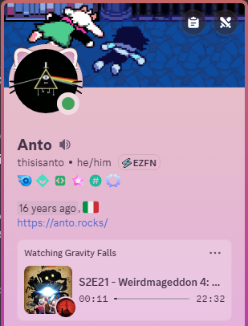

# Jellyfin RPC
A Userbot-powered RPC program for Jellyfin! No Discord client required!

> [!CAUTION]
> While I never had any issues with this program after using it for a few months, I cannot guarantee that your account will be 100% safe as userbots are against the [Discord TOS](https://discord.com/terms), therefore **I don't take any responsibility for blocked Discord accounts in case a block might happen!**

## How does this work?
As mentioned in the previous warning, JellyfinRPC uses a userbot to update your RPC based on what you're watching on Jellyfin. It makes use of the Webhook plugin to receive realtime events directly from your Jellyfin instance without having to contact your Jellyfin instance's API every few seconds or so.

Due to the way RPC is handled, JellyfinRPC ensures that your account doesn't always appear as online:

- By default, your status is set to invisible.
- When Jellyfin fires an event to the program (such as starting playback), your status goes idle.
- When playback stops, your status returns to invisible.

Note: The "invisible" and "idle" statuses set by JellyfinRPC can be overridden by another Discord client. For example, if you're online on desktop while JellyfinRPC is idle, Discord will show you as online.

## Screenshots
  

## Setting up
You will need:
- NodeJS 18+
- Your Discord account's token
- A Discord bot's token
- A Discord server

Steps:
1. Clone (or download) this repo
2. In the JellyfinRPC folder, install all the Node modules via the `npm install` command.
3. Make a copy of the `.env.example` file and rename it into `.env`, then fill all the needed details:
    - If you need help getting your Account token, check [Getting your account token](#getting-your-account-token) 
    - If you need help getting your Bot token, check [Getting a Discord Bot token](#getting-a-discord-bot-token)
    - Finally, if you need help getting your channel ID, check [Getting a channel ID](#getting-a-channel-id)
4. Run `npm start`

JellyfinRPC should now be listening on the port you specified in the .env file!

Now that the JellyfinRPC setup is done, you will need to move over to Jellyfin:
1. On Jellyfin, press your profile icon and go in the Dashboard
2. Go to **My Plugins** and click on **Webhook**
    - If you don't have Webhook installed, click on the **Catalog** and search for it, then install it and restart your Jellyfin server as specified.
3. Set your server url to something that you know the device that's running JellyfinRPC can access. If both programs are running on the same machine, then the URL (if you haven't changed your port) will be `http://127.0.0.1:8096`
    - If the programs are running on separate networks, then the URL needs to be something accessible over the Internet.
4. Add a Generic Destination
5. Insert the Webhook Url
    - As above, the same rules apply (make sure you use JellyfinRPC's port and not Jellyfin's)
    - Example URL: `http://127.0.0.1:3000/jellyfin/webhook`
    - NOTE: **`/jellyfin/webhook` IS REQUIRED!** Changing this part will cause JellyfinRPC to not receive any events.
6. Add the following Notification Types:
    - Playback Progress
    - Playback Start
    - Playback Stop
7. Add an User Filter based on the profile you use to watch your content, if you have multiple profiles.
    - Adding multiple profiles will most likely cause your users fighting when JellyfinRPC receives an event, meaning that your presence may change if there's another user watching a content while you're watching something.
8. Add the following Item Types:
    - Movies
    - Episodes
    - Series
    - Other media types are currently not supported and will cause JellyfinRPC to crash. Support for them will be added in the future.
9. Get the Template from [templates/movies_and_series.handlebars](templates/movies_and_series.handlebars) and paste it in the text box.
10. If you set up an auth key, add the following Request Header:
    - Key: Authorization
    - Value: {your AUTH_KEY}
11. Press Save

Done! If done correctly, your JellyfinRPC should start receiving events from Jellyfin and update your Discord presence accordingly.

### Getting your account token

To get your account token, you will need to use your browser (or your Discord client)'s DevTools:
- Open DevTools (`F12`/`CTRL+SHIFT+I`)
- Go into the Network tab
- On Discord, open any kind of channel
- In all of the requests, you will see a `messages?limit={limit}` request, click on it and look at the Request Headers:
    - In the `Authorization` header, you should see a token: that's your account token!
    - Example: 

> [!CAUTION]
> **MAKE SURE TO KEEP YOUR ACCOUNT TOKEN PRIVATE!** Your Account token is the "magic word" to get into your account, if anyone gets their hands on it they can effectively do anything to your account while also bypassing 2FA. Be safe!

### Getting a Discord Bot token
JellyfinRPC requires a Bot token to upload and refresh an image's link (like a movie's image), this is required as Discord forces you to use a Discord CDN link when setting an image in your RPC.

Fortunately, this is way easier than getting an account token:
- Go to your [Discord Developers Dashboard](https://discord.com/developers/applications)
- Create a New Application (or use an existing one if you'd like)
- In your application, go to the `Bot` tab and press `Reset Token`
    - A 2FA code may be required if you have it set up in your account
    - Example: 
- You now have your Bot token!

### Getting a channel ID

You will need a Discord server with your bot added for this.

To add your bot to the server:
1. Go to the OAuth2 tab in your application in the Developer Dashboard
2. Scroll until you see the OAuth2 URL Generator
3. In the scopes, select `bot`
    - If you need to, you can also add permissions to your bot manually via the URL Generator. Keep in mind that the bot will need access to the channel as it will need to send all the series/movie's images
4. Copy the link, navigate to it
5. Select the server where you want to add the bot and press Authorize

Now that your bot is in the server, you will need to get the ID of a channel:

> [!TIP]
> I highly suggest using a channel you don't use, as the bot is going to send all the images in the channel you provide to JellyfinRPC

1. Enable [Discord Developer Mode](https://support-dev.discord.com/hc/en-us/articles/360028717192-Where-can-I-find-my-Application-Team-Server-ID)
2. Go to your server, create a new channel (or use an existing one)
3. Right click your channel
4. Press `Copy Channel ID`
5. Done!